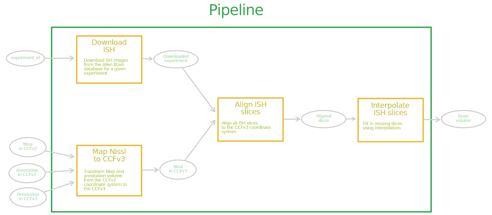
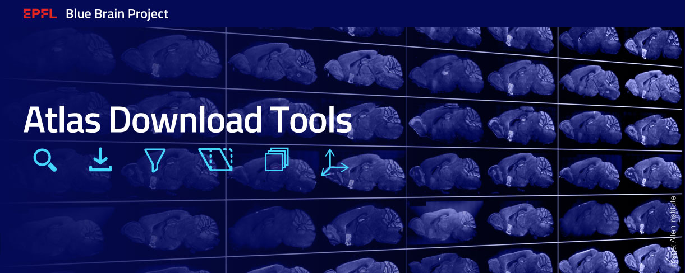
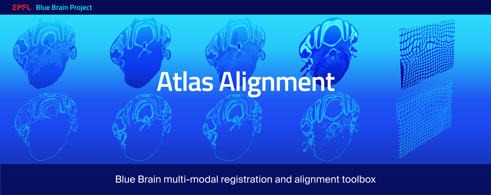
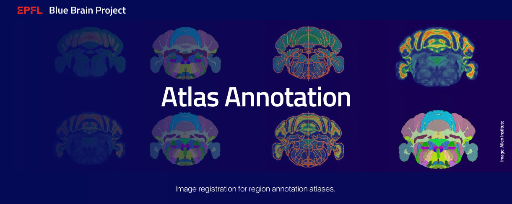
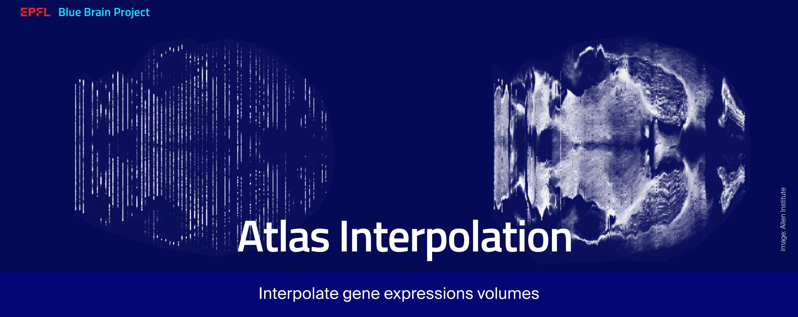

# Deep Atlas
Deep Atlas is a suite of tools created by the Blue Brain Project to manipulate
brain atlas images. 

## Full pipeline
See below a simplified sketch of the entire pipeline.


Note that a lot of details are omitted and the user is encouraged to read
the `--help` of relevant scripts.

All the scripts are lying in the `pipeline/` directory.

```bash
pipeline/
├── download_gene.py
├── full_pipeline.py
├── gene_to_nissl.py
├── interpolate_gene.py
├── nissl_to_ccfv3.py
```

To run the entire pipeline one needs to use `full_pipeline.py`. However,
it is also possible to run different stages of the pipeline separately.

### `full_pipeline.py`

See below the `--help` of the `full_pipeline.py` script.

```bash
usage: full_pipeline.py [-h] [--coordinate-sys {ccfv2,ccfv3}]
                        [--downsample-img DOWNSAMPLE_IMG]
                        [--interpolator-name {linear,rife,cain,maskflownet,raftnet}]
                        [--interpolator-checkpoint INTERPOLATOR_CHECKPOINT]
                        [-e] [-f]
                        nissl_path ccfv2_path ccfv3_path gene_id
                        output_dir

positional arguments:
  nissl_path            Path to Nissl Volume.
  ccfv2_path            Path to CCFv2 Volume.
  ccfv3_path            Path to CCFv3 Volume.
  experiment_id         Experiment ID to use.
  output_dir            Path to directory where to save the results.

optional arguments:
  -h, --help            show this help message and exit
  --coordinate-sys {ccfv2,ccfv3}
                        Downsampling coefficient for the image download.
  --downsample-img DOWNSAMPLE_IMG
                        Downsampling coefficient for the image download.
  --interpolator-name {linear,rife,cain,maskflownet,raftnet}
                        Name of the interpolator model.
  --interpolator-checkpoint INTERPOLATOR_CHECKPOINT
                        Path of the interpolator checkpoints.
  -e, --expression      If True, download and apply deformation to
                        threshold images too.
  -f, --force           If True, force to recompute every steps.

```

The user is supposed to provide the following inputs (positional arguments)

* `nissl_path` - path to a Nissl volume
* `ccfv2_path` - path to an annotation volume in the CCFv2 reference space
* `ccfv3_path` - path to an annotation volume in the CCFv3 reference space
* `experiment_id` - unique identifier of the ISH experiment


Note that there are multiple optional arguments. For example, one
can decide what coordinate system to use - `ccfv2` or `ccfv3`. By providing
the flag `--expression` preprocessed expression images are going to be
included. Finally, one can also pass stage specific parameters 
(e.g. `--interpolator-name` for the interpolation stage).


## Docker
We provide a docker file that allows you to run the `pipeline` on a docker container. 
To build the docker image run the following command:

```bash
docker build 
-f docker/Dockerfile
-t deep-atlas-pipeline
.
```
By default, the user is `guest` but if one wants to configure a specific user, 
one needs to first uncomment the line and add the info about the users.
The list of users has a comma separated list of users with the format `<username>/<userid>`.
```bash
ENV DEAL_USER_IDS="$(whoami)/$(id -u)"
```
or one can define the environment variable and use add this info 
to the CLI command of `docker build`
```bash
export DEAL_USER_IDS="$(whoami)/$(id -u)"
docker build \
-f docker/Dockerfile \
-t deep-atlas-pipeline \
--build-arg DEAL_USER_IDS \
.
```

To run the container use the following command:
```bash
docker run --rm -it deep-atlas-pipeline
```

## Dependencies
The full pipeline depends on multiple other projects.
- [Atlas Download Tools](#atlas-download-tools) — Search, download, and prepare
  atlas data.
- [Atlas Alignment](#atlas-alignment) — Perform multimodal image registration
  and alignment.
- [Atlas Annotation](#atlas-annotation) — Image registration for region
  annotation atlases.
- [Atlas Interpolation](#atlas-interpolation) — Slice interpolation for atlases.

Each of the projects is described in more detail below.

### Atlas Download Tools


Useful links:
[GitHub repo](https://github.com/BlueBrain/Atlas-Download-Tools),
[Docs](https://atlas-download-tools.readthedocs.io).

**Search, download, and prepare atlas data.**

Among different sources of data, Allen Brain Institute hosts a rich database of
gene expression images, Nissl volumes, and annotation atlases. The
Atlas-Download-Tools library can help you to download single section images and
entire datasets, as well as the corresponding metadata. It can further
pre-process the image data to place it in the standard reference space.


### Atlas Alignment


Useful links:
[GitHub repo](https://github.com/BlueBrain/atlas-alignment),
[Docs](https://atlas-alignment.readthedocs.io).

**Multimodal registration and alignment toolbox.**

Atlas Alignment is a toolbox to perform multimodal image registration. It
includes both traditional and supervised deep learning models. This project
originated from the Blue Brain Project efforts on aligning mouse brain atlases
obtained with ISH gene expression and Nissl stains.

### Atlas Annotation


Useful links:
[GitHub repo](https://github.com/BlueBrain/atlas-annotation),
[Docs](https://atlas-annotation.readthedocs.io).

**Align and improve brain annotation atlases.**

Over the years the Allen Brain institute has constantly improved and updated
their brain region annotation atlases. Unfortunately the old annotation atlases
are not always aligned with the new ones. For example, the CCFv2 annotations
and the Nissl volume are not compatible with the CCFv3 annotation and the
corresponding average brain volume. This package proposes a number of methods
for deforming the Nissl volume and the CCFv2 annotations in order to re-align
them to CCFv3.

### Atlas Interpolation


Useful links:
[GitHub repo](https://github.com/BlueBrain/atlas-interpolation),
[Docs](https://atlas-interpolation.readthedocs.io).

**Interpolate missing section images in gene expression volumes.**

The Allen Brain Institute hosts a rich database of mouse brain imagery. It
contains a large number of gene expression datasets obtained
through the in situ hybridization (ISH) staining. While for a given gene
a number of datasets corresponding to different specimen can be found, each of
these datasets only contains sparse section images that do not form a
continuous volume. This package explores techniques that allow to interpolate
the missing slices and thus reconstruct whole gene expression volumes.


# Funding & Acknowledgment
The development of this software was supported by funding to the Blue Brain Project, a research center of the École polytechnique fédérale de Lausanne (EPFL), from the Swiss government's ETH Board of the Swiss Federal Institutes of Technology.
 
Copyright © 2021-2022 Blue Brain Project/EPFL


